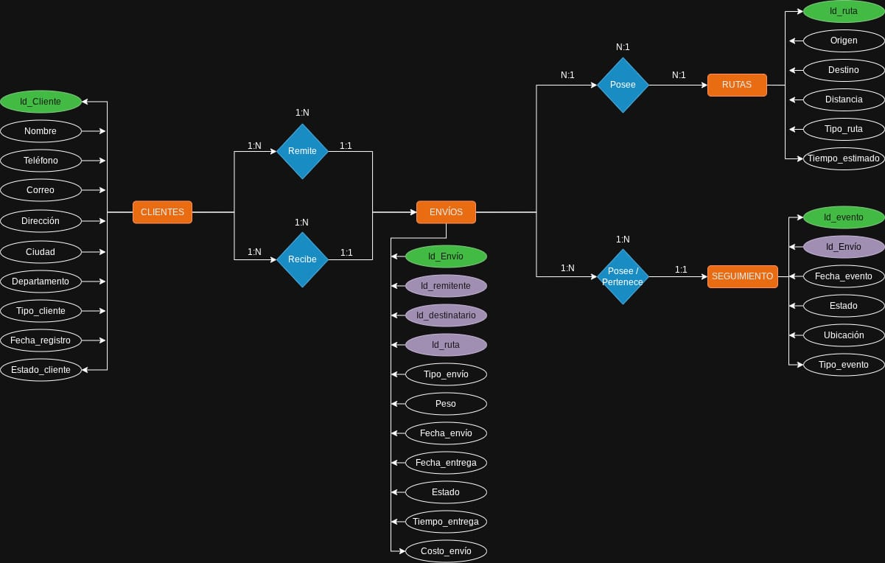
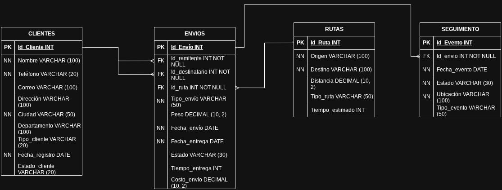

# PROYECTO 3 — LOGÍSTICA Y TRANSPORTE DE ENVÍOS

## Contexto

Base de datos para una empresa de logística encargada de gestionar envíos de mercancía. El sistema debe permite registrar envíos, clientes, rutas y seguir del estado de los paquetes.

## Alcance

El modelo de datos contempla:

• Clientes

• Envíos

• Rutas

• Eventos de seguimiento

## Descripción de las entidades

• Clientes: Información de quienes envían o reciben paquetes.

• Envíos: Registro principal de cada paquete con origen, destino, peso y estado.

• Rutas: Definición de trayectos logísticos entre ubicaciones.

• Seguimiento: Registro de eventos en el ciclo de vida del envío (recogido, en tránsito, entregado).

## Reglas de negocio

• Un cliente puede generar múltiples envíos.

• Cada envío tiene un origen y un destino.

• Un envío puede tener múltiples eventos de seguimiento.

• Cada evento registra fecha, estado y ubicación.

## Simplificaciones

• No se optimizan rutas automáticamente.

• No se modela asignación de vehículos.

• No se incluyen costos operativos detallados.

## Objetivo analítico

El modelo permite analizar:

• Tiempos de entrega

• Estados de los envíos

• Volumen de envíos por cliente o región

• Eficiencia en entregas

# Modelado de Datos

## Incluye:

• Diagrama Entidad-Relación (ER)

• Modelo relacional

